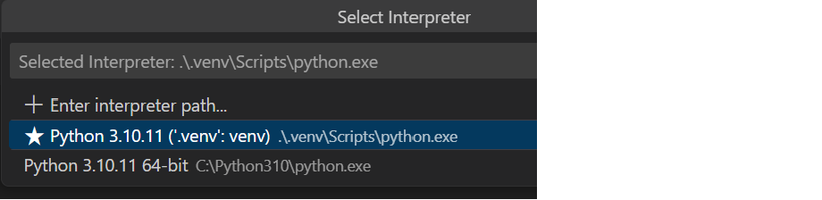
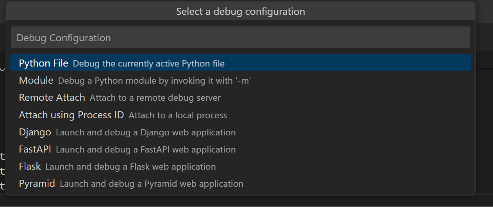

# Building Copilot

App contains of two applications

1. pythonAPI: this will deliver an api that can run generated python code against the bgrid api
2. TeamsApp: Contains the logic to chat and generate the python code, call api and generate adaptive card from JSON output.

## Run app

- Open pythonapi and TeamsApp separately in a Visual Code session

For the python app:

- Copy .nev.template to .env
- Fill in bgrid username / password
- Choose the Python Environment (<ctrl>P)

- Run the python App
- Choose FastAPI to run the API when selected
 

For the TeamsApp:

- Just F5 and Run